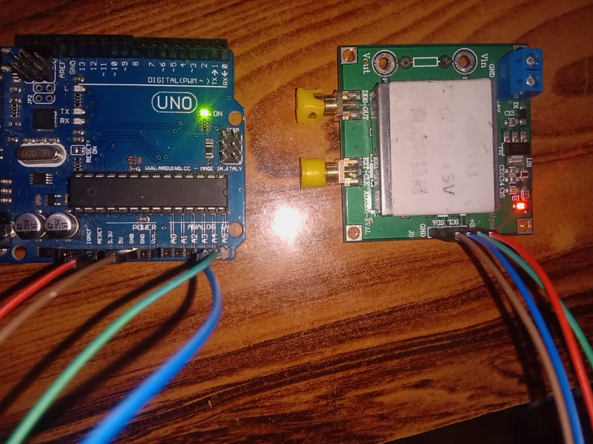
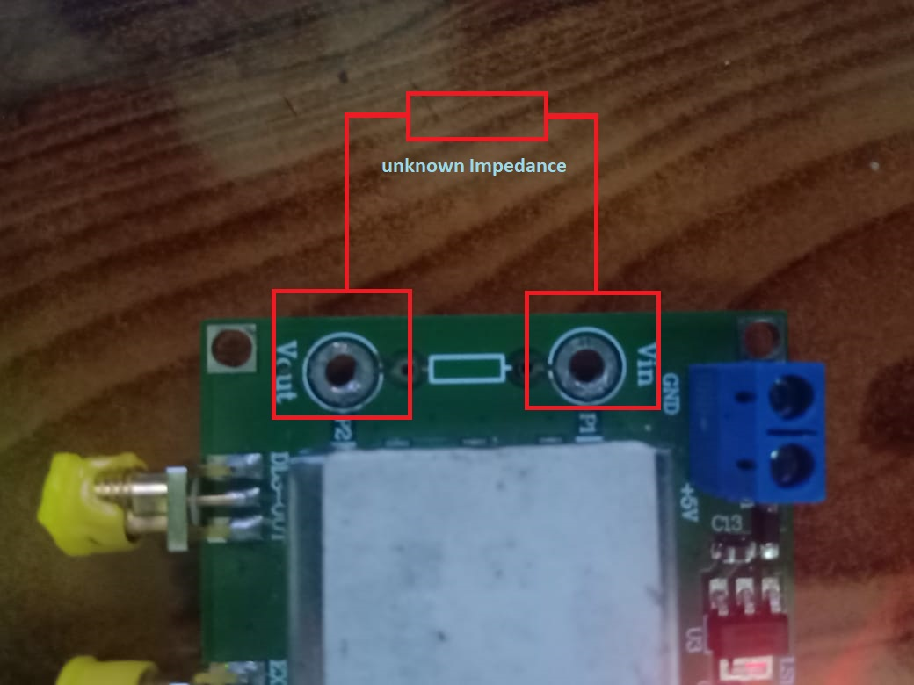
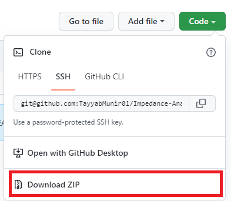

# Overview
The AD5933 is a device from Analog Devices which can perform impedance spectroscopy. It uses I2C protocol protocol and its a slave device with address of 0x0D. I used Arduino as the master device to control the AD5933. Following are the steps to do impedance spectroscopy on the device.

## Components Needed
1. AD5933
2. Arduino
3. Wires 
4. Resistors/Capacitors to test

## Softwares Needed
1. Arduino IDE for uploading code to arduino [Click here to download arduino](https://www.arduino.cc/en/software)

# Connecting Arduino with AD5933

### **here are the pin connections**
1. 3.3V (Arduino)  -->  +3.3V (AD5933)
2. Gnd  (Arduino)  -->  GND (AD5933)
3. A4   (Arduino   -->  SDA (AD5933)
4. A5   (Arduino)  -->  SCL (AD5933)

## unknown impedance is connected between Vin and Vout terminals

## Download the required files for AD5933 on your Computer from my github repository.

## Extract the Files.

## Open the Arduino File **Impedance_Analyzer.ino**

## Select the Arduino Board you are using and Port on which ardiono in connected

## Upload the Code on Arduino

***

## Click on the Serial monitor Button and Arduino ide will show readings on the serial monitor window

above readings are for 220kohm resistor
